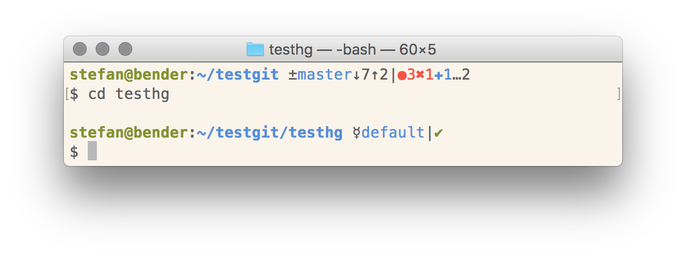
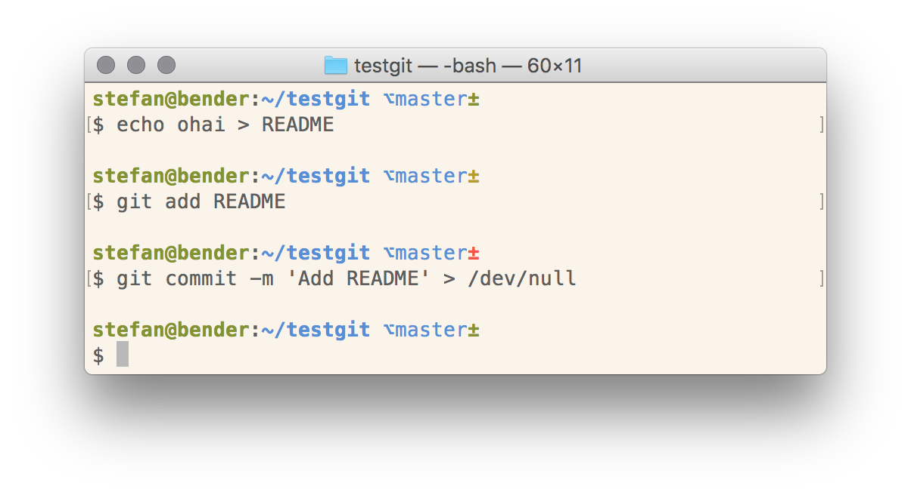

Informative version control prompt for your shell
=================================================

A small program that prints a summary of the current git/hg repository for use in a shell prompt (like Bash or ZSH).

You can choose between two styles – one with full details and a minimal one.
Both styles can be configured as you like.


## Detailed Style

The detailed style shows the VCS name or symbol, your current branch, the number of commits you are ahead/behind a tracking branch as well as the number of staged files, changed files, untracked files and conflicts.



[See it in action!](https://asciinema.org/a/126175)


## Minimal Style

The minimal style only shows the current branch and encodes the repository status in the color of the VCS symbol:
*green* means clean, *yellow* indicates untracked files or unstaged changes and *red* means there are staged files.



[See it in action!](https://asciinema.org/a/126176)


## Prompt Structure

The general structure of the detailed format is:
```
{vcs name/symbol}{branch}{branch tracking}{operations}|{local status}
```
The structure of the minimal format is:
```
{branch}{colored vcs symbol}
```

### `{vcs name/symbol}`

You can show either the VCS name (*git* or *hg*) or just a symbol (*±* or *☿*).

### `{branch}`

This is just the current branch’s name.
In Mercurial repos, the name of the current bookmark is also shown there (e.g., `default*mybookmark`).

### `{branch tracking}`

```
↑n    ahead of remote by n commits
↓n    behind remote by n commits
↓m↑n  branches diverged, other by m commits, yours by n commits
```

Branch tracking symbols are only shown for Git repos:

### `{operations}`

This is a list of ongoing operations, e.g., a merge (`|MERGING`) or bisect (`|BISECTING`).

### `{local status}`

```
✔︎     repository clean
✚n    there are n staged files
✖︎n    there are n unmerged files
↻n    there are n modified (but unstaged) files
…n    there are n untracked files
```

Mercurial automatically stages changed files, so *modified* files will always be shown as *staged*.

## Installation

You can download a [binary release](https://github.com/sscherfke/rust-vcprompt/releases) or use one of the following methods to install rust-vcprompt.

### Homebrew

On MacOS, you can use [Homebrew](https://brew.sh):

```bash
$ brew tap sscherfke/rust-vcprompt
$ brew install rust-vcprompt
```

### Cargo

You can use Cargo to install directly from [crates.io](https://crates.io)

```bash
$ cargo install --root=$HOME/.local vcprompt
```

### Build from source

- Install Rust and Cargo.
- Clone this repo and `cd` into it.
- Run `cargo build --release`.
- Copy `target/release/vcprompt` somewhere into your `PATH`.


## Usage and Customisation

Insert `$(vcprompt)` (or `$(vcprompt --minimal)` for the minimal style) into the prompt variable of your shell (e.g., `PS1` in `.bashrc` or `PROMPT` in `.zshrc`.

You can configure the appearance of the output by exporting one of the following environment variables in your shell’s config file:

```bash
export VCP_PREFIX=" "
export VCP_NAME="{symbol}"  # You can use "value" or "symbol" here
export VCP_BRANCH="{blue}{value}{reset}"
export VCP_OPERATION="{red}{value}{reset}"
export VCP_BEHIND="↓{value}"
export VCP_AHEAD="↑{value}"
export VCP_SEPARATOR="|"
export VCP_STAGED="{blue}✚{value}"  # +
export VCP_CONFLICT="{red}✖︎{value}"  # ×
export VCP_CHANGED="{yellow}↻{value}"  #
export VCP_UNTRACKED="{magenta}…{value}"
export VCP_CLEAN="{green}✔︎"  # ✓
export VCP_SUFFIX="{reset}"
```

The values above are the default values and are ordered in the same way as they appear in the output.

The placeholders `{value}`/`{symbol}` are replaced by the corresponding values.
The placeholders `{reset}`, `{bold}`, `{black}`, `{red}`, `{green}`, `{yellow}`, `{blue}`, `{magenta}`, `{cyan}`, and `{white}` are replaced by the corresponding ANSI color codes.

The minimal style only uses the variables `VCP_PREFIX`, `VCP_BRANCH`, `VCP_BEHIND`, `VCP_AHEAD` and `VCP_SUFFIX`.


## Why?

This program is inspired by (and can be configured to be compatible with) the [oh-my-zsh git-prompt](https://github.com/robbyrussell/oh-my-zsh/tree/master/plugins/git-prompt) and the original [vcprompt C implementation](https://bitbucket.org/gward/vcprompt).

Rust-vcprompt is way faster than the Python git-prompt (and similar Python scripts).
On my machine it takes ~12ms for smaller repos and ~24ms for repos with thousands of commits while the Python implementations need at least 50ms.
This makes rust-vcprompt more suitable for synchronous prompts (which you usually use).

The C implementation has a comparable performance to rust-vcprompt and also supports more VCS.
However, rust-vcprompt gives you more flexibility with formatting your prompt.
